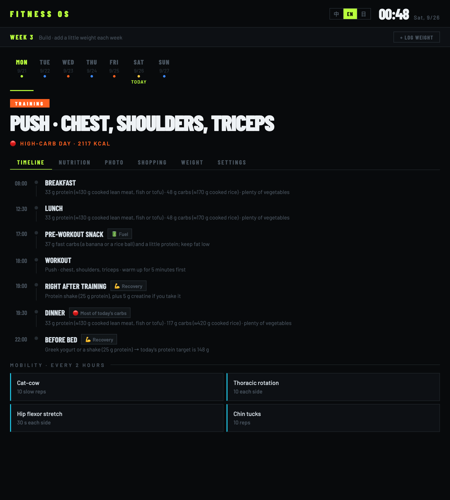
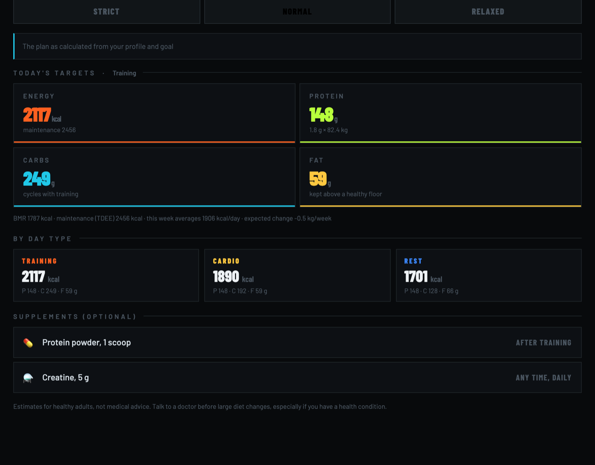
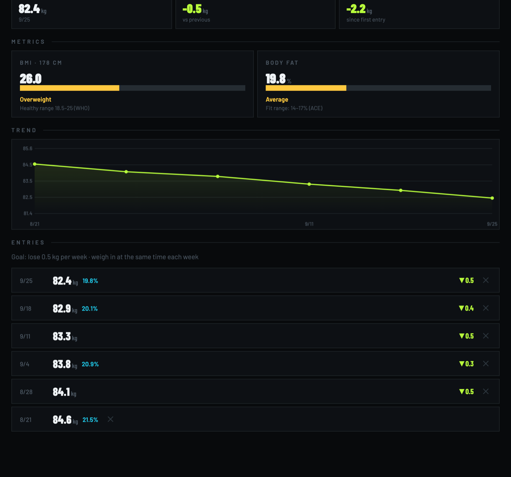
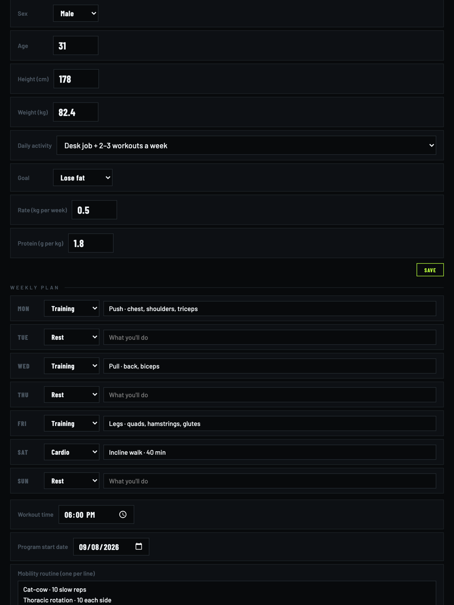
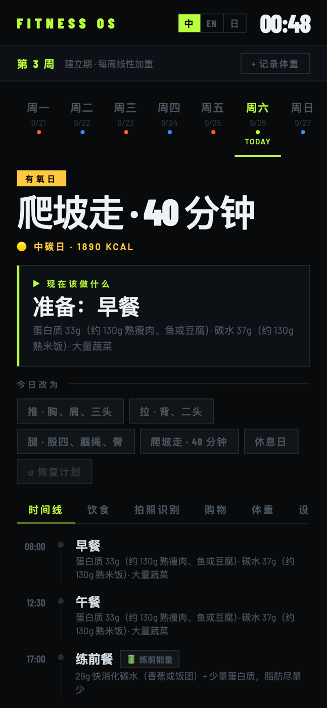

<p align="center">
  <a href="../README.md"></a>
  <a href="README.zh-CN.md"></a>
  <a href="README.ja.md"></a>
</p>

<h1 align="center">🏋️ Fitness OS</h1>

<p align="center">
  ブラウザで動く、毎日のトレーニングと食事のプランナー。<br>
  一週間の予定を決めておけば、何を食べ、いつ鍛え、何を買うかを毎日教えてくれます。
</p>

<p align="center">
  <a href="https://shinnaaa.github.io/GymSchedule/"><b>アプリを開く →</b></a>
</p>

<p align="center">
  <a href="https://github.com/Shinnaaa/GymSchedule/actions/workflows/ci.yml"></a>
  
  
  <a href="../LICENSE"></a>
</p>

<p align="center"></p>

---

## 機能

- **週間プラン** —— 曜日ごとにトレーニング・有酸素・休養を選び、内容を書き込みます（例：「プッシュ · 胸・肩・三頭」）。プログラムの何週目か、どの段階（慣らし → 構築 → 本格）かを表示します。
- **一日のタイムライン** —— 食事、トレ前の補食、トレーニング、トレ後のリカバリー、就寝前のプロテインを、*あなたの*トレーニング時刻に合わせて配置。「いま」カードが今やることと次の予定を示します。
- **カーボサイクル** —— カロリーとPFCは日によって変わります。トレーニング日は炭水化物を多く、休養日は少なく、週平均が目標どおりになるよう調整。その日の炭水化物の大半はトレーニング後最初の食事に回します。
- **あなたの体から計算** —— BMR は Mifflin-St Jeor 式（男女別）、活動レベルから TDEE、目標ペースから不足分・余剰分（1 kg = 7,700 kcal）を算出。タンパク質は体重 1 kg あたりのグラム数で設定します。摂取量が低すぎる場合は警告が出ます。
- **食事レベル** —— 厳しめ（−5%）・標準・ゆるめ（+5%）をその日だけ選べます。設定は変わりません。
- **写真でカロリー推定** *(任意)* —— 食事を撮ると Google Gemini が品目ごとのカロリーと栄養素を推定し、ワンタップで今日の記録に追加。手入力もできます。
- **買い物リスト** —— その日の目標から、タンパク源・主食・野菜などの量を算出。
- **体重記録** —— 体重と任意の体脂肪率、推移グラフ、週ごとの変化、BMI（WHO 基準）、体脂肪率の区分（ACE 基準・男女別）。
- **今日だけ変更** —— 脚の日を休みにした？今日の予定を差し替えれば、すべての数値が追従します。
- **モビリティのリマインド** —— デスクワーク中に 2 時間ごと行う、自分用のストレッチ。
- **English / 中文 / 日本語**、ブラウザの言語で自動選択、いつでも切り替え可能。

<p align="center">
  
  
</p>

## 使い方

1. [shinnaaa.github.io/GymSchedule](https://shinnaaa.github.io/GymSchedule/) を開きます。最初はサンプルの身体データで表示されるので、まずは眺めてみてください。
2. **設定**で性別・年齢・身長・体重・活動レベル・目標を入力し、週間プラン、トレーニング時刻、プログラム開始日を設定します。
3. 毎日**タイムライン**を確認し、週に一度体重を記録します。

データはすべてブラウザの `localStorage` に保存され、アカウントもサーバーもありません。**設定 → バックアップを書き出す**でバックアップや他の端末への移行ができ、**バックアップを読み込む**で復元できます。

### 写真でカロリー推定（任意）

ご自身の [Gemini API キー](https://aistudio.google.com/apikey)が必要です（無料枠で十分）。**設定 → 写真認識**に貼り付けてください。写真とキーはブラウザから Google の API に直接送られるだけで、キーは URL ではなくリクエストヘッダーで送信されます。*この端末に保存する*にチェックしない限り、キーはページを閉じるまでメモリにのみ保持されます。モデルの応答は信頼できないデータとして扱い、解析・検証・妥当な範囲への丸めを行ってからテキストとして表示し、合計は品目から再計算します。

> **医療上の助言ではありません。** 数値は集団平均に基づく推定です。持病がある方、妊娠中の方、18 歳未満の方は、食事を変える前に医師や管理栄養士にご相談ください。

<p align="center">
  
  
</p>

---

## 数値の計算方法

| | |
|---|---|
| BMR | Mifflin-St Jeor：`10·kg + 6.25·cm − 5·年齢 + 5`（男性）または `− 161`（女性） |
| TDEE | BMR × 1.2 / 1.375 / 1.55 / 1.725（座りがち / 軽い / 中程度 / 活発） |
| 1 日の増減 | 目標ペース（kg/週）× 7,700 kcal ÷ 7。減量なら差し引き、増量なら加算 |
| 日の重み | トレーニング 1.12、有酸素 1.0、休養 0.9 —— *あなたの*一週間で正規化し、週平均が目標に一致 |
| タンパク質 | g/kg × 体重（既定 1.8） |
| 脂質 | 0.6–0.8 g/kg とその日のカロリーの 25–35% の大きい方（炭水化物が少ない休養日はやや多め） |
| 炭水化物 | 残りのカロリー（最低 30 g） |

週平均の摂取量が BMR の 90% を下回ると、週のサマリーに警告が出ます。

### バージョン 2.0 の変更点

バージョン 1 は一人のために書かれた単一の HTML ファイルで、身体データ、トレーニング予定、時刻がすべてコードに埋め込まれ、UI は中国語のみでした。バージョン 2 では誰でも設定できる、テスト付きのモジュール構成に作り直し、その過程で見つかった次の問題を修正しました。

- **AI の応答による XSS。** Gemini が返す食品名を `innerHTML` で挿入していたため、細工した画像やモデルの異常な出力でタグやスクリプトを注入できました。現在はすべてテキストとして描画します。
- **API キーが URL に含まれていた。** Gemini キーを `?key=` クエリで送っていたため、ログや履歴に残りました。現在は `x-goog-api-key` ヘッダーで送信します。
- **再読み込みで食事記録が消えていた。** 認識した食品はメモリにしかありませんでした。現在は保存され、30 日より古い記録は自動で削除されます。
- **買い物の分量が誤っていた。** 買い物リストが日の種類（`train`）を、食事レベル（`high`）を期待する計算関数に渡していたため、ご飯の量が別の日の炭水化物で計算されていました。
- **食事レベルの説明が計算と一致しなかった。** 説明文は固定の数値で、実際の計算結果と食い違っていました。現在は同じコードから生成します。
- **BMR が男性の式のみだった。** 女性にも男性の式を使っていました（約 166 kcal 高い）。
- **タイムラインの重なり。** 食事がトレーニング中に配置されることがありました。現在はトレーニング終了 30 分後にずらします。

バージョン 1 のデータ（`localStorage` の `fitness_*`）は、初回起動時に体重記録も含めて自動で移行されます。

---

## 開発

```bash
npm install
npm run dev      # 開発サーバー
npm test         # Vitest：栄養、プラン、タイムライン、買い物、身体指標、食事記録、認識結果の解析、保存と v1 移行
npm run lint     # oxlint
npm run build    # → dist/
```

push のたびに lint・テスト・ビルドを実行し、`main` を GitHub Pages にデプロイします。プロジェクト構成は [English README](../README.md#project-layout) を参照してください。

## ライセンス

[MIT](../LICENSE)
